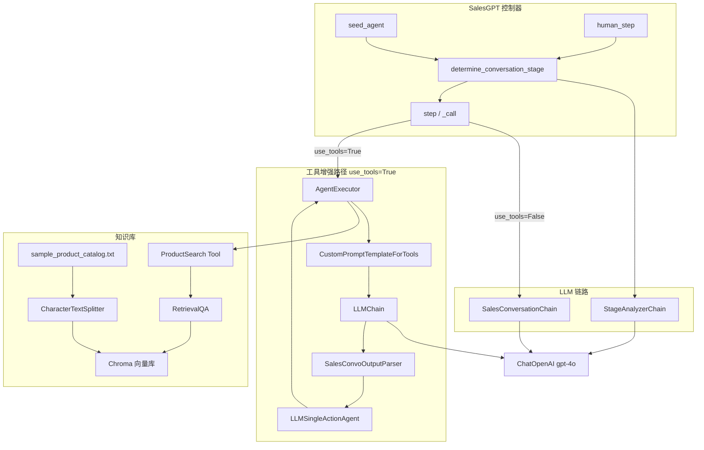
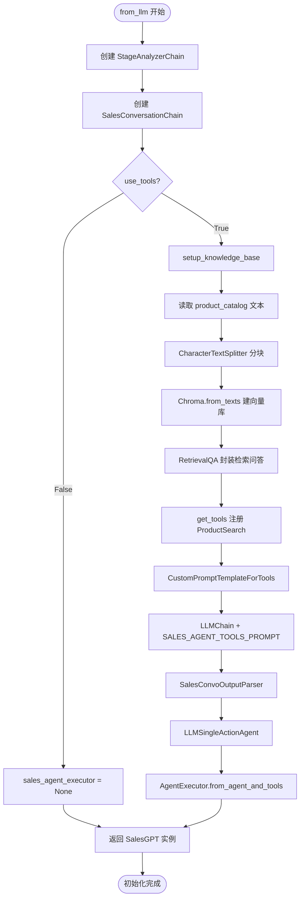
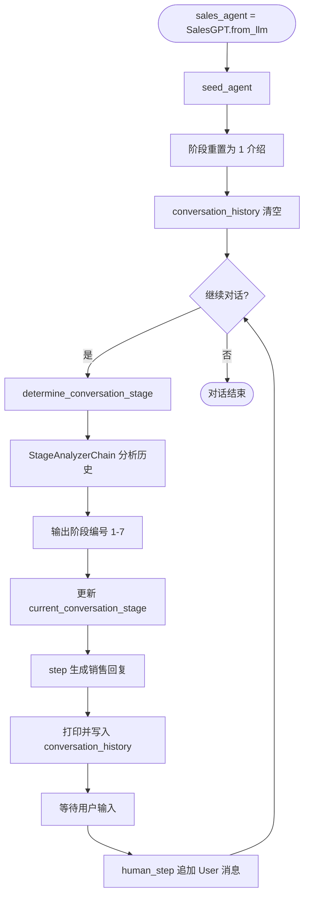
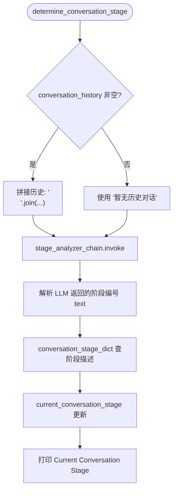
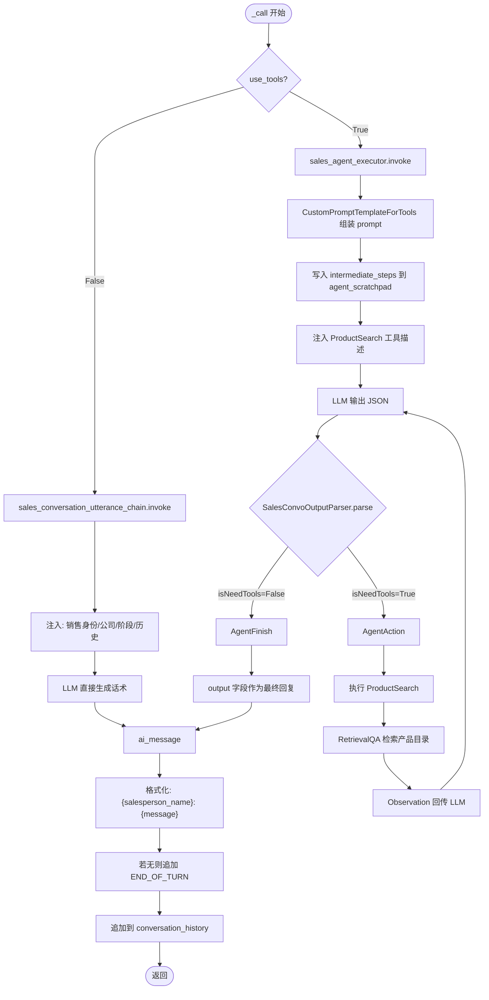
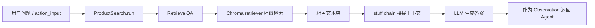
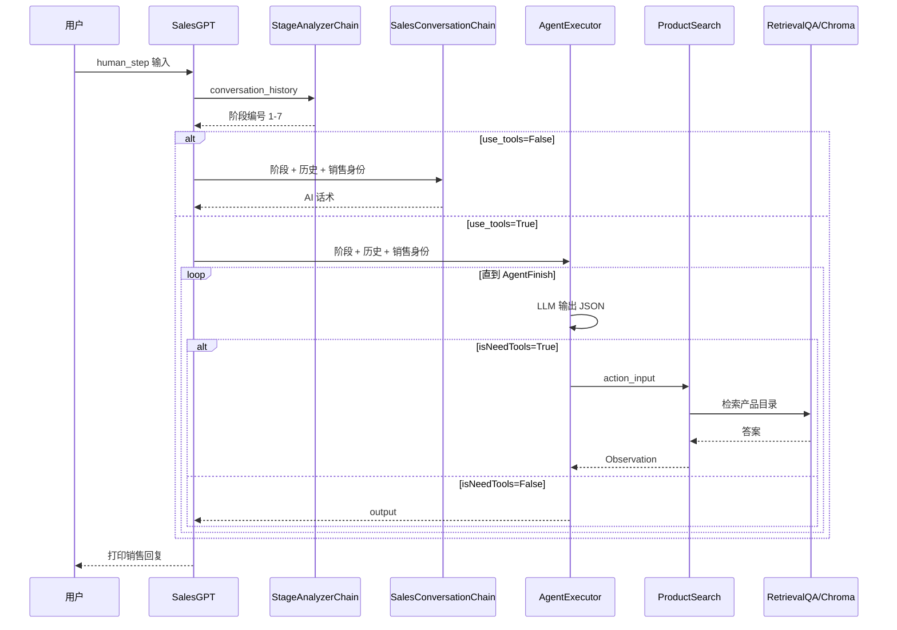

# Sales Agent 流程图

基于 [agent/agent_sales_agent.py](../agent/agent_sales_agent.py) 梳理 Sales Agent 的组件架构、初始化流程、对话主循环，以及「带工具 / 不带工具」两种响应生成路径。

## 1. 整体架构

Sales Agent 以 `SalesGPT` 为核心控制器，串联「阶段分析」「话术生成」「知识库检索」三条链路。

---

## 2. 初始化流程 (`SalesGPT.from_llm`)

关键代码入口：

- 工厂方法：`SalesGPT.from_llm`（[agent_sales_agent.py](../agent/agent_sales_agent.py) 约 420–480 行）
- 知识库：`setup_knowledge_base`（约 145–156 行）
- 工具注册：`get_tools`（约 158–172 行）

---

## 3. 对话主循环（脚本底部示例）

脚本末尾演示了一轮完整交互：

对应执行序列（517–528 行）：

1. `seed_agent()` — 初始化
2. `determine_conversation_stage()` — 分析阶段
3. `step()` — AI 首轮回复
4. `human_step("好的。能否介绍一下问界M7")` — 用户输入
5. `determine_conversation_stage()` — 再次分析阶段
6. `step()` — AI 第二轮回复

---

## 4. 阶段判定流程 (`determine_conversation_stage`)

**7 个销售阶段**（`conversation_stage_dict`）：

| 编号 | 阶段 | 目标 |
|------|------|------|
| 1 | 介绍 | 自我介绍、说明来电原因 |
| 2 | 资格 | 确认对方是否为合适决策者 |
| 3 | 价值主张 | 说明产品独特卖点 |
| 4 | 需求分析 | 开放式提问挖掘痛点 |
| 5 | 解决方案展示 | 针对需求展示方案 |
| 6 | 异议处理 | 回应客户疑虑 |
| 7 | 结束/成交 | 提出下一步行动 |

> 工具模式 prompt 中还定义了第 8 阶段「结束对话」（客户离开、不感兴趣等），但 `conversation_stage_dict` 仅映射 1–7。

---

## 5. 单步响应生成 (`step` → `_call`)

这是核心分支：根据 `use_tools` 选择不同生成路径。

### 工具模式 JSON 协议

LLM 必须返回以下 JSON 之一（`SalesConvoOutputParser`，约 222–237 行）：

- **不需要工具**：`{"isNeedTools": "False", "output": "..."}`
- **需要工具**：`{"isNeedTools": "True", "action": "ProductSearch", "action_input": "..."}`

`AgentExecutor` 在 `isNeedTools=True` 时循环：调用 `ProductSearch` → 将检索结果作为 `Observation` → 再次请求 LLM，直到返回 `AgentFinish`。

---

## 6. 知识库检索子流程

- Embedding 模型：`HuggingFaceEmbeddings`（`bge-large-zh-v1.5`）
- 数据源：[sample_product_catalog.txt](../agent/sample_product_catalog.txt)
- 分块参数：`chunk_size=10, chunk_overlap=0`

---

## 7. 数据流总览

---

## 8. 关键类与职责

| 类/函数 | 职责 |
|---------|------|
| `StageAnalyzerChain` | 根据对话历史判断当前应处于哪个销售阶段 |
| `SalesConversationChain` | 无工具模式下生成下一句销售话术 |
| `SalesGPT` | 状态管理（历史、阶段）+ 编排各链路 |
| `CustomPromptTemplateForTools` | 动态注入工具列表与 ReAct scratchpad |
| `SalesConvoOutputParser` | 解析 JSON，区分直接回复 vs 工具调用 |
| `setup_knowledge_base` | 构建 Chroma + RetrievalQA 产品知识库 |
| `AgentExecutor` | 工具模式下驱动 LLM ↔ 工具 多轮循环 |
